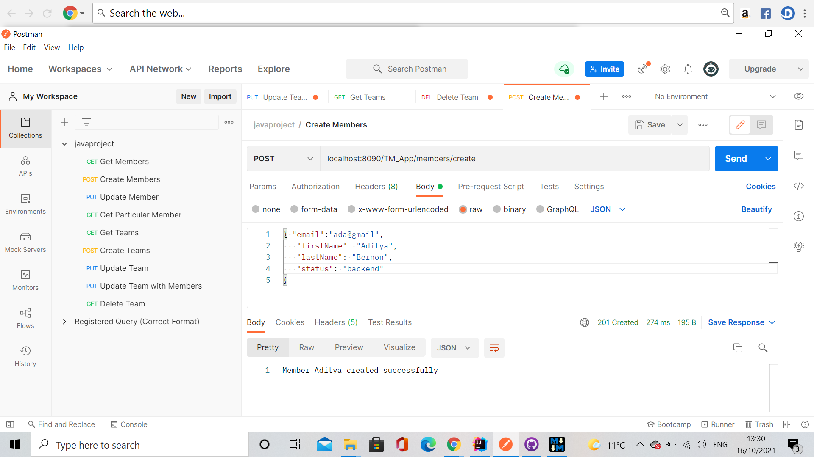
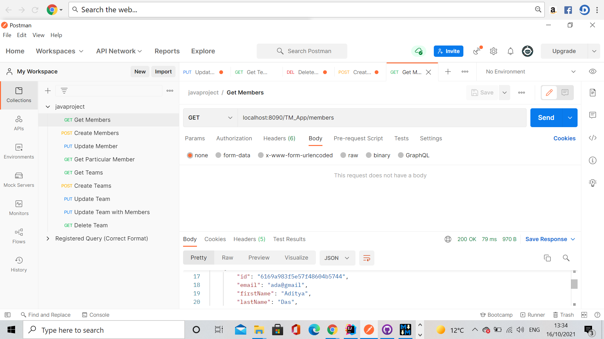
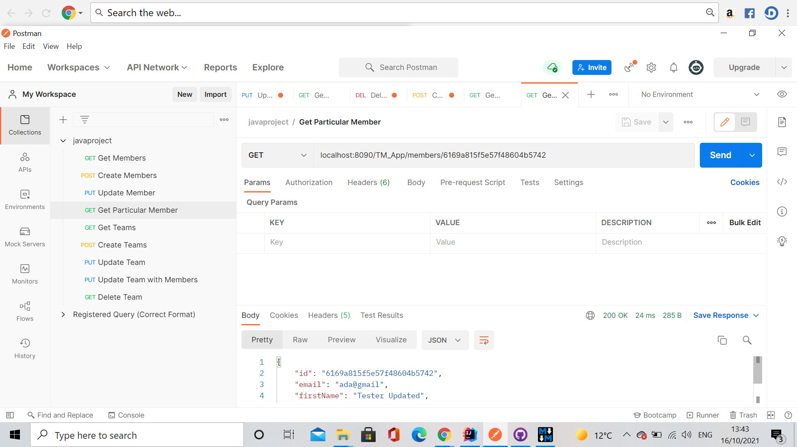
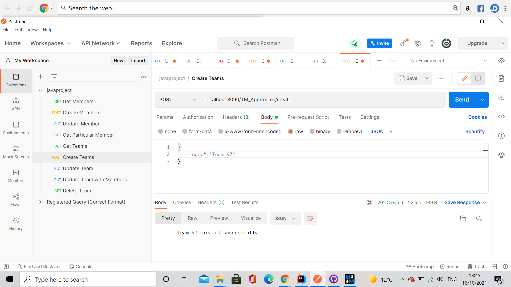
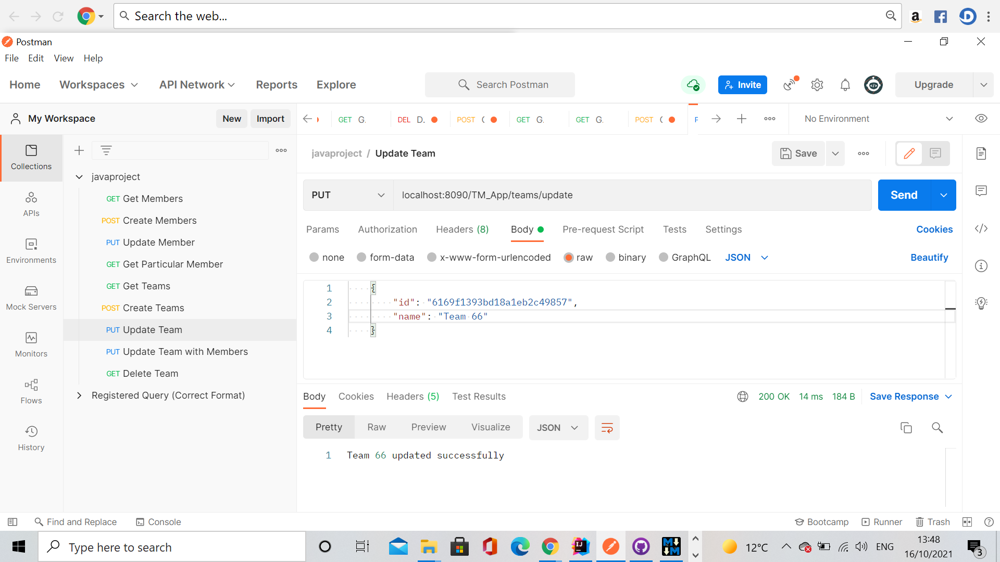
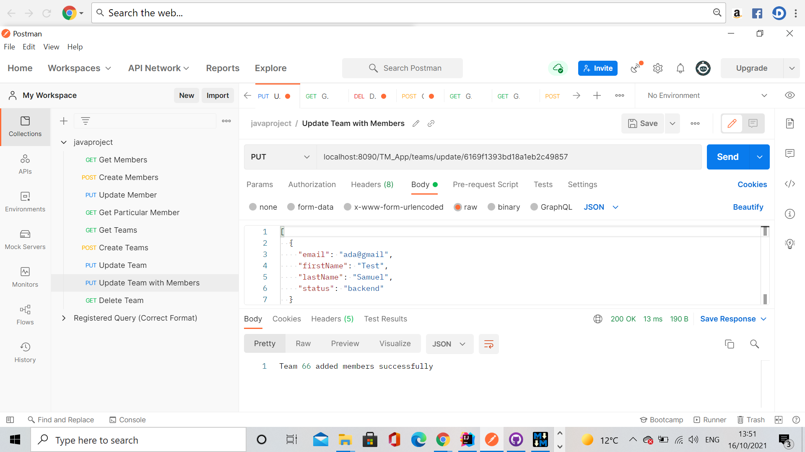
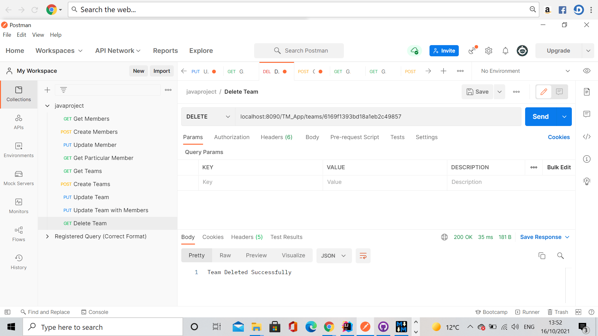

# Instructions on how to run the backend application

This guide shows how to run the application and make requests using Postman. You can use some other tools if you would like, such as cURL.To run the application, go to TeamsMembersApplication file in the source folder (src) and run it (can be done using the command line too). Following which, open Postman, create a collection and make the following requests.

## To Create a Member

## To Get Members

## To Get a particular Member

## To Create Team

## To Get Team

## To Update Team

## To Update Team with Member

## To Delete Team

Note: In almost all cases, the team id is very important to perform an operation.

# Run Unit Tests

For this, go to the file TeamsMemberApplicationTest in folder 'test' and run it.

